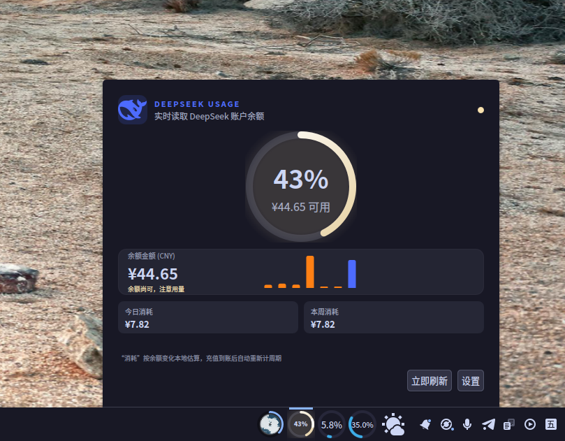
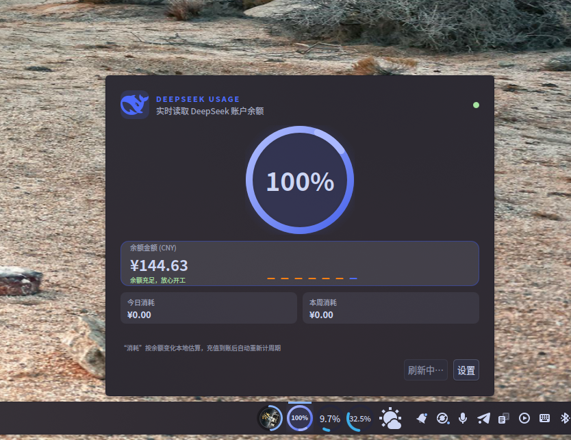
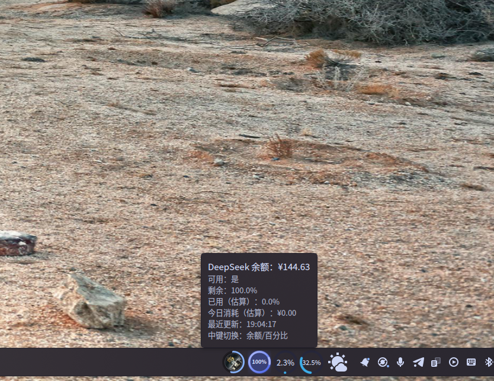

# 🐋 DeepSeek Usage Monitor

**A Plasma 6 widget that keeps an eye on your DeepSeek API balance — right in the taskbar.**

No need to open the DeepSeek console to check how much balance you have left. The widget polls the **free balance API**, shows the number on a small taskbar icon, and warns you before you run out.


*Full-screen look — the balance badge sitting in the taskbar*

## ✨ Features

- 💰 **Live balance** — polls the DeepSeek balance API on a configurable interval (default 60 s, minimum 30 s)
- 📉 **Estimated usage** — since DeepSeek has no public usage endpoint, consumption is estimated locally from balance changes between polls
- 🔔 **Low-balance notification** — system notification when balance drops below a threshold you set (default ¥10)
- 📊 **Usage history** — periodic snapshots (up to 300) with a bar chart, so you can see your spending over time
- 🎯 **Compact taskbar modes** — show balance (`¥12.34`) or remaining percent (`68%`)
- 🖱️ **Hover popup** — balance, estimated usage, last update time, and the usage chart
- ⚙️ **Fully configurable** — refresh interval, low-balance threshold, warning/critical percent, compact display mode
- 🧮 **Free to use** — the balance API itself does not consume tokens


*Hover popup with balance, estimated usage and controls*


*Usage history chart*


*Hovering the taskbar icon*

## 📦 Requirements

- KDE Plasma 6 (6.0 or later)
- Qt 6 (Quick, Quick Layouts, Kirigami)
- A [DeepSeek API key](https://platform.deepseek.com/api_keys)

## 🛠️ Installation

```bash
plasmapkg2 --install deepseek-usage-v1.0.0.tar.gz
```

or extract into `~/.local/share/plasma/plasmoids/` and restart the shell:

```bash
plasmashell --replace
```

Then right-click the panel → **Add Widgets** → search **DeepSeek Usage Monitor**.

## ⚙️ Configuration

After adding the widget, open its settings and paste your API key:

1. Right-click the widget → **Configure** → **General**
2. Paste your DeepSeek API key (keep it private — it is stored in your local Plasma config, never sent anywhere except DeepSeek's own API)
3. Adjust refresh interval / thresholds if you like

> The widget uses the balance API with `Authorization: Bearer <your-key>` — the key is only sent to `api.deepseek.com`.

## 🔧 Compatibility

- Tested on **Plasma 6.x / Wayland** (X11 should also work)
- DeepSeek API region: `https://api.deepseek.com`

## 📄 License

**GPL-2.0-or-later**
